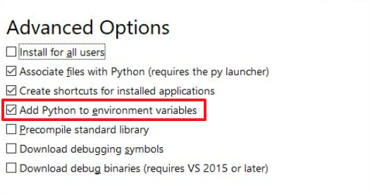
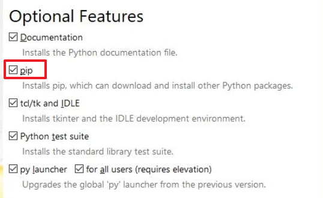

===========
基础介绍
===========

入门教程
=========

推荐几个教程吧，适合入门：

- `官方文档`_
- `廖雪峰的 Python 教程`_
- `菜鸟教程`_

.. _官方文档: https://docs.python.org/zh-cn/3/tutorial/index.html
.. _廖雪峰的 Python 教程: https://www.liaoxuefeng.com/wiki/1016959663602400
.. _菜鸟教程: https://www.runoob.com/python3/python3-tutorial.html

一些技巧和提示
===============

1. 安装 Python 时记得勾选 add to PATH（添加到环境变量），不然安装后命令行中找不到 Python。

2. 安装 Python 过程中记得勾选 pip 相关的选项，把 pip 工具一起安装上。

3. IDE 推荐 Pycharm 或 Spyder，两者可以自己去搜搜视频之类的感受下，查查各自的特点。

- Pycharm 社区版就够用了，不用专业版。官网上拉到最下面有不同版本的下载链接
- 轻量级的编辑器推荐 VSCode，启动快速，也可以直接运行 Python 脚本

4. python 默认的包管理器是 pip，也可以选择 Anaconda，教程网上很全的。

- 使用 pip 的情况下由于其服务器在国外，访问可能比较慢，可以使用如下命令指定为国内源

.. code-block:: shell

    # 此命令在 cmd 中运行，
    # 意义为从国内源安装 Nunpy包
    pip install -i https://pypi.tuna.tsinghua.edu.cn/simple Numpy

5. Pycharm 中学会使用在命令行中运行代码，学会查看变量值/格式。

6. 学会写注释，注释不仅是给别人看的，更是给自己看的，过了很久你可能忘了这个变量是干嘛的，但是注释不会消失，
它会一直在那里为读者指路。

7. 变量命名别太随意，最好有实际意义，哪怕是汉语拼音也可以，其实 Python 是支持中文变量名的。
除了循环或者一些计数的变量可以使用 i，a 之类随意的名称外，建议统一采用缩写或拼音。

