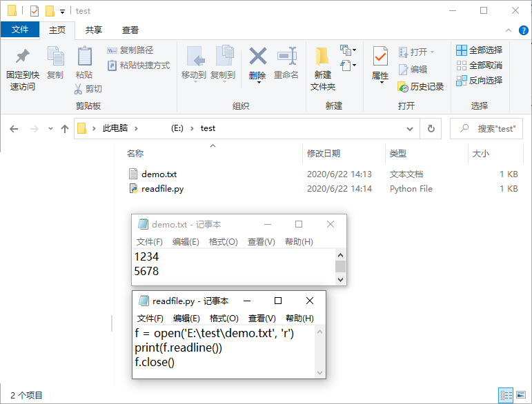
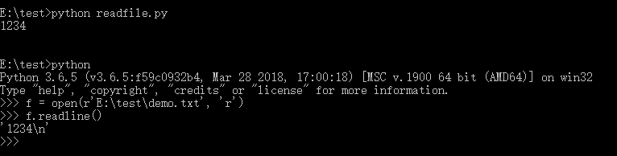

===========
文件读写
===========

文件路径
========

首先要认识什么是文件路径，文件路径分为绝对路径和相对路径。绝对路径就是类似
``E:\A\demo.txt``，这表示了 E 盘下有个 A 文件夹，其中的demo.txt 文件。
相对路径就是相对于脚本所在文件夹（当前工作目录）的文件路径，如 ``.\demo.txt``
表示跟脚本相同目录下的 demo.txt。

现在我在 E 盘下新建一个 test 文件夹，在其中创建一个 demo.txt，输入一串文字并保存。
之后再创建一个 readfile.py 脚本，内容如下：

.. code-block:: python

    f = open('E:\test\demo.txt', 'r')
    print(f.readline())
    f.close()

之后运行 readfile.py。

.. note::

    Python 脚本运行小技巧

    使用 IDE 运行的话可以看到运行中的输出信息及报错。
    但是很多时候并不想启动 IDE，只是想运行一个调试好的脚本该怎么办呢？

    默认打开方式设置为 Python 的情况下直接双击就可以运行了。

    .. image:: img/dakaifangshi.png

    但是这样运行的结果是一闪而过的。无法看清输出的内容或报错。如果是把结果保存为文件的话
    这样是没问题的，但是如果运行出了问题的话是要看报错信息的，那该怎么办呢？

    我们可以使用命令行调用 Python 来运行脚本。步骤如下：

    .. image:: img/inputcmd.png
    
    在文件路径栏位置输入 cmd，开启当前文件夹下的一个 cmd 窗口。

    .. image:: img/yunxing.png

    调用 Python 运行脚本。

运行后发现居然报错了！
``Invalid argument`` 是参数错误，明明传进去的就是从文件管理器里复制出来的路径啊，怎么就参数错误了呢？

理解这个需要了解一个定义叫 **转义字符**。

计算机编程中有一些特殊的含义的字符编码，比如回车换行符等，这些字符在编程过程中
我们使用反斜杠\加上字母来表示，这个组合就叫做转义字符。常见的一些转义字符如下表所示。

.. table::

    =========  =========
     转义字符     含义
    =========  =========
       \\r      回车   
       \\n      换行   
       \\t      制表符 
       \\ \\        反斜杠 
    =========  =========

我们传入的路径中恰好出现了 **\\t**，Python 解释器就把这个解释为转义字符了。而转义字符 **\\ \\** 表示其本身。
因此我们应使用这样的路径来保证转义字符的问题：``f = open('E:\\test\\demo.txt', 'r')``。
这样双反斜杠被解释为单独的反斜杠，就不会出错了。

但是每次都要添加反斜杠会很麻烦，我们可以在字符串的引号前加 ``r`` 来避免这个问题：
``f = open(r'E:\\test\\demo.txt', 'r')``。``r`` 表示此字符串不转义，所见即所得。
更改代码为

.. code-block:: python

    # 使用绝对路径
    f = open(r'E:\test\demo.txt', 'r')
    print(f.readline())
    f.close()

运行可得到如下结果：

可见我们成功的读出了一行。行末的换行符 **\\n** 也被读出了，但是使用 print 函数输出的时候
直接被解释为换行了，所以多空了一行。

至此我们学会了使用绝对路径来打开文件。而使用相对路径就简单很多了，直接使用如下脚本：

.. code-block:: python

    # 使用相对路径
    f = open('demo.txt', 'r')
    print(f.readline())
    f.close()

打开工作目录（脚本所在文件夹）下的文件直接打开文件名字符串即可。

文件列表
=========

首先介绍 glob 模块，glob 模块是最简单的模块之一，内容非常少。用它可以查找符合特定规则的文件路径名。跟使用 windows 下的文件搜索差不多。
查找文件只用到三个匹配符："*", "?", "[]"。"*" 匹配 0 个或多个字符；"?" 匹配单个字符；"[]" 匹配指定范围内的字符，如：[0-9] 匹配数字。

.. code-block:: python

    >>> import glob                             # 导入 glob 模块
    >>> filelist = glob.glob('*.*')             # 使用 glob 模块下的 glob 函数获取工作目录下的所有文件
    >>> filelist
    ['demo1.txt', 'demo2.txt', 'readfile.py']
    
    >>> import os
    >>> os.path.splitext(filelist[0])           # 使用 splitext 获取文件名和扩展名
    ('demo1', '.txt')

结合上面两个函数，我们只要获取文件名列表并遍历一遍，筛选出满足条件的文件名即可（比如是 txt 文件）。

.. code-block:: python

    import glob                             # 导入 glob 模块
    import os
    
    filelist = glob.glob('*.*')             # 使用 glob 模块下的 glob 函数获取工作目录下的所有文件

    for filename in filelist:
        if os.path.splitext(filename)[1] == '.txt':     # 使用 splitext 获取文件名和扩展名，
                                                        # os.path.splitext 返回的是元组，索引 0 对应的是文件名，索引 1 是扩展名
                                                        # 所以使用 [1] 索引出扩展名，判断格式。
            # Do something
        else:
            continue        # 继续循环
    
但是这么写需要加 if，看着不太优雅，那我们可以换一种列表生成器写法，直接生成满足条件的列表：

.. code-block:: python

    # 列表生成器写法
    >>> f_list = [filename for filename in glob.glob('*.*') if os.path.splitext(filename)[1]=='.txt']
    >>> f_list
    ['demo.txt', 'demo2.txt']

之后遍历列表即可。
点击此处可以查看完整的文件读写示例 :doc:`../示例/文件读写示例`。